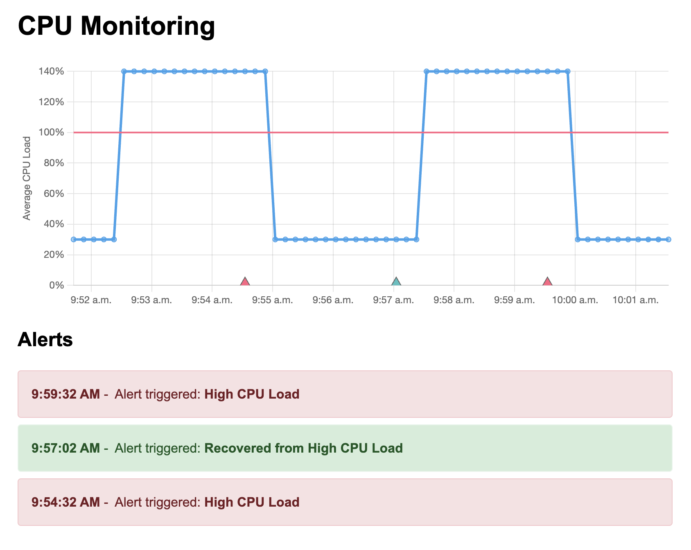

# CPU Load Monitor

A proof-of-concept for monitoring CPU load application.



```sh
npm install         # Install dependencies.
npm run build       # Build project.
npm test            # Run unit tests.
npm run dev         # Run project dev with file watcher.
npm run preview     # Run project in preview mode.
```

Note: This project has been tested against Node.js version `22.0.0`, NPM version `10.5.1` on MacOS.

## Technical consideration

This application is a client-side rendered React application. It retrieves CPU load data from a Node.js backend using short polling. The server exposes a REST API over JSON.

- The REST API is sufficient for this use case. There is no clear benefit to exposing a GraphQL or RPC-based API, as the API is simple, there are no complex relationships to model, and no complex mutations are required.
- Each sample of data includes a unique timestamp. Since work on the server's main JavaScript thread can delay or interfere with CPU load sampling, tracking the timestamp for each sample ensures more precision than returning a list of values.
- The server maintains a buffer of CPU load samples from the last 10 minutes. This enables the UI to display data when the application loads. Keeping a history of CPU load data also allows the application to recover from being backgrounded and throttled by the browser.

## API endpoints

### GET `/v1/api/metrics/cpu-load`

Returns a list of average CPU loads sampled over a specified time range.

**Query parameters:**

- `since` (optional, number): A Unix timestamp (in milliseconds) representing the start of the time range. If not provided, data from the last 10 minutes is returned.

**200 Response:**
Returns an object with a single property `data`, which is an array of data point objects. Each data point has the following properties:

- `ts`: A Unix timestamp (in millisecond).
- `value`: The normalized average CPU load.

## Next steps

The next steps can be categorized into production readiness, addressing technical debt, and closing feature gaps.

**Production Readiness:** Essential before going to production

- Basic Service Protection: Implement basic service protection (e.g., rate limiting at the API gateway) to prevent API overload, as the API cannot scale horizontally.
- Error Handling: Add proper error handling to both the client application and the API.
- Observability and Instrumentation: Implement basic monitoring to track usage and errors.

**Technical Debt:** Technical trade-offs that should be addressed in the future

- Persist CPU Load History: Persist CPU load history data to survive process crashes. Storing API state outside of memory is the first step towards making the API horizontally scalable.
- Evaluate alternative charting libraries: [Chart.js](https://www.chartjs.org/) is fine for a proof-of-concept however its limited customization level and large bundle size will not be suitable in the long run.
- Reduce Refresh Rate: Reduce the refresh rate when the browser tab is not focused to reduce server load.
- Improve Build Process, CI/CD: Invest time in improving the build process, continuous integration, and continuous deployment.
- Add Integration and Smoke Tests: Implement proper integration tests and smoke tests for the project. This is required step to enable continuous deployment.

**Feature Gaps:** Features worth adding in the future

- User Configurations: Allow end-users to configure the application’s refresh rate, alerting thresholds, and durations.
- Browser Notifications: Use the browser's built-in Notification API to report alerts.
